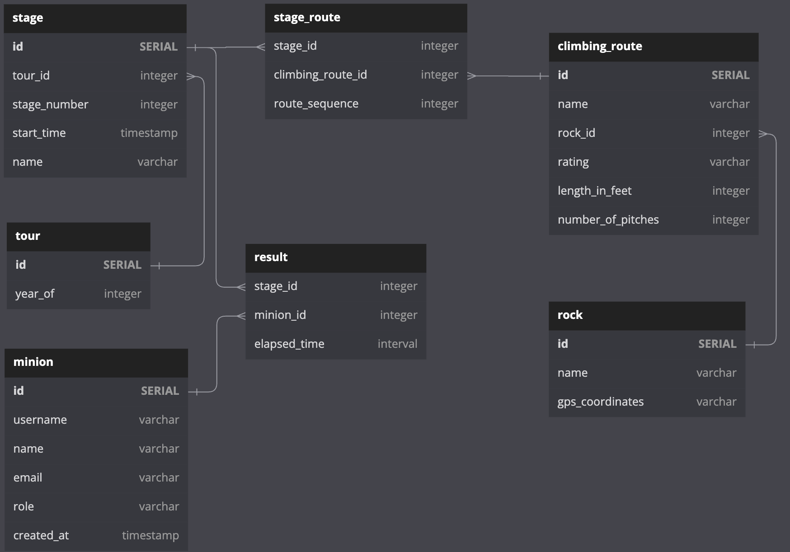

# Sam's Minions Scrambling Club

## Overview

This site is built using node, express, and postgres. It is packaged for delivery
using docker and the Dockerfile in the home directory. This repository is hosted
on GitHub here: https://github.com/billwright/smsc

## Building the Docker Image

```
> npm run build
```

This will execute the following command:

```bash
> docker build --tag csci3308registry.azurecr.io/smsc_server .
> docker images                                               
REPOSITORY                                   TAG             IMAGE ID       CREATED          SIZE
csci3308registry.azurecr.io/smsc_server      latest          f54b74834108   43 seconds ago   316MB
smsc_server                                  latest          f54b74834108   43 seconds ago   316MB

```
> **_NOTE_** The philosophy I'm using for this
project is to put all useful functions in the package.json file so that all
contributers will have access to all the scripts I'm using.

## Testing the Docker Image

Via the command line:


Via the Docker Desktop UI:


## Deployment

### Azure Postgres Database

This application uses Postgres as our SQL database. The database is called SMSC and has been created in Azure. It runs on a server machine named smsc-db-server. This is a server-less database that is spun down after 1 hour of inactivity. Hence, it could take a bit to spin back up. Make sure the app can handle this. The Azure database dashboard is here: https://portal.azure.com/#@colorado.edu/resource/subscriptions/6bb797a5-c098-4e34-8058-b6ca22814590/resourceGroups/csci-3308-ResourceGroup/providers/Microsoft.DBforPostgreSQL/flexibleServers/smsc-db-server/overview 


My home console for Azure is here: 
The admin credentials for logging into this database are:

user: satan
ps: Scrambling!

Currently, this site is deployed to Azure and can be viewed here: https://csci3308simple-server.azurewebsites.net/ 

This isn't right. It was for a demo app, but once I deploy, update this.

It is automatically deployed via a GitHub Actions pipeline that can be viewed here:


## Database Schema



## Local testing

To test this service, first start up the docker postgres image like this:

```bash
> docker run -it --rm --env POSTGRES_PASSWORD=password postgres
```
Or just do:

```bash
> npm run startDB
```

If the database isn't connected, we'll have to create it:

```bash
> psql --host=localhost --port=5432 --username=postgres --command='create database smsc;'
Password for user postgres: 
CREATE DATABASE
```

Now load the starting data into the database:

```bash
> npm run loadDB
```

Next start the server so that it automatically restarts on changes with:

```bash
> npm start
```

This is defined in the package.json file as:

```json
"start": "echo 'Copying proper .env file...' && cp environments/.env.smsc ./.env && nodemon index.js"
```

This copies the local environment file to the local directory so that those properties are used when starting up the server. 

### Code coverage

I'm using nyc for code coverage and that is configured by the
.nycrc file in the root directory.

Documentation is here: https://www.npmjs.com/package/nyc 