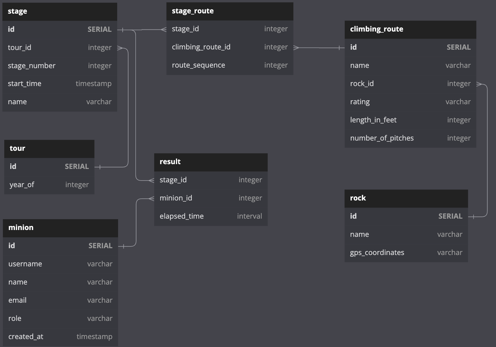

# Satan's Minions Scrambling Club

## Overview

This site is built using node, express, and postgres. It is packaged for delivery
using docker and the Dockerfile in the home directory. This repository is hosted
on GitHub here: https://github.com/billwright/smsc

## Deployment

Currently, this site is deployed to Azure and can be viewed here: https://csci3308simple-server.azurewebsites.net/ 

This isn't right. It was for a demo app, but once I deploy, update this.

It is automatically deployed via a GitHub Actions pipeline that can be viewed here:


## Database Schema



## Local testing

To test this service, first start up the docker postgres image like this:

```bash
> docker run -it --rm --env POSTGRES_PASSWORD=password postgres
```

Next start the server so that it automatically restarts on changes with:

```bash
> npm start
```

This is defined in the package.json file as:

```json
"start": "echo 'Copying proper .env file...' && cp environments/.env.smsc ./.env && nodemon index.js"
```

This copies the local environment file to the local directory so that those properties are used when starting up the server. 
